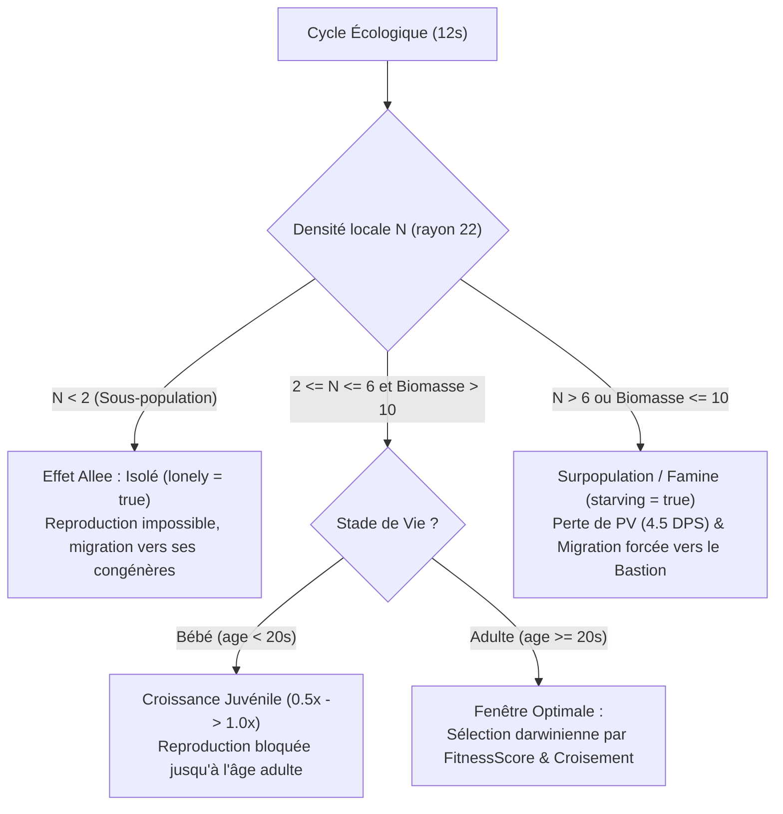
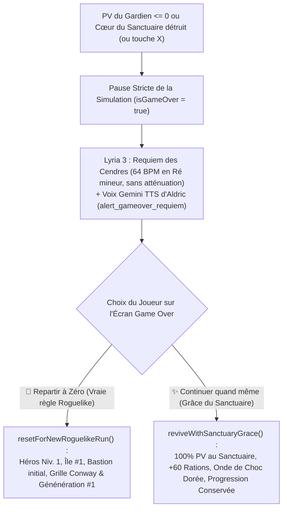

# Genesis Bastion — Document d'Architecture & Design Systémique (`Design.md`)

Ce document détaille les modèles mathématiques, écologiques, génétiques et comportementaux au cœur de **Genesis Bastion**.

---

## 1. Dynamique des Populations : Jeu de la Vie de Conway Continu & Biomasse

Le monde 3D ($240 \times 240$ unités) est subdivisé en une grille écologique spatiale de $24 \times 24$ cellules ($10 \times 10$ unités par cellule). Chaque cellule possède une réserve de **Biomasse** (`BASE_BIOMASS = 100`, régénérée de `+18` par cycle selon le biome).

À chaque **Cycle Écologique (`ECO.TICK_INTERVAL = 12s`)**, chaque créature évalue sa densité locale dans un rayon `NEIGHBOR_RADIUS = 22` :

### Cycle de Vie : Monstres Bébés (Juvéniles) $\rightarrow$ Adultes
- **Naissance à l'état Bébé (`lifeStage: 'baby'`, `isAdult: false`)** : Tout nouvel individu issu d'une reproduction naît à `age = 0` avec une taille visuelle réduite (`BABY_SCALE = 0.5x`) et des statistiques de combat réduites (`BABY_STAT_MULT = 0.55x`).
- **Impossibilité de se reproduire** : Tant que `age < CONFIG.ECO.MATURATION_TIME` (`20s`), un bébé ne peut pas être sélectionné comme parent lors d'un cycle écologique.
- **Intérêt tactique majeur** : Lorsqu'un Patient Zéro se reproduit ou qu'un mutant de novo naît, le joueur dispose d'une fenêtre de **20 secondes** pendant laquelle la progéniture mutante est encore juvénile, plus faible et stérile, permettant d'endiguer la contagion avant une croissance exponentielle.

---

## 2. Algorithme Génétique & Formule du `fitnessScore`

Chaque créature possède une instance de `Genome` comprenant :
- **Gènes quantitatifs continus (`genes`)** : `size`, `speed`, `strength`, `maxHp`, `fertility`, `metabolism`, `aggroRadius`.
- **Mutations qualitatives (`mutations: string[]`)** : Liste d'identifiants de mutations issues de `CONFIG.MUTATIONS`.

### Calcul Explicite du `fitnessScore` (Stats + Mutations)
Lors de la sélection des parents dans une cellule optimale, la probabilité d'être choisi comme reproducteur est proportionnelle au **`fitnessScore`** de l'individu :

$$\text{FitnessTotal} = \text{StatsScore} + \text{MutationsScore}$$

Où :
1. **`StatsScore`** est la moyenne pondérée des gènes normalisés par rapport aux valeurs de base de l'espèce, pénalisée par la consommation métabolique :
   $$\text{StatsScore} = 0.28 \frac{\text{strength}}{S_0} + 0.24 \frac{\text{maxHp}}{H_0} + 0.18 \frac{\text{speed}}{V_0} + 0.15 \frac{\text{fertility}}{F_0} + 0.08 \frac{\text{size}}{Z_0} + 0.07 \frac{M_0}{\text{metabolism}}$$
2. **`MutationsScore`** est la somme des bonus d'adaptation darwinienne (`fitnessBonus`) de chaque mutation portée :
   $$\text{MutationsScore} = \sum_{m \in \text{mutations}} \text{Bonus}(m)$$

### Dominance Mendélienne des Mutations Adaptatives
Contrairement aux gènes continus qui s'héritent par croisement interpolé ($\pm 6\%$ de dérive gaussienne), les mutations adaptatives suivent une **hérédité mendélienne dominante** :
- **1 parent porteur** : **78 %** de probabilité de transmission à l'enfant (`DOMINANT_INHERITANCE_SINGLE = 0.78`).
- **2 parents porteurs** : **92 %** de probabilité de transmission à l'enfant (`DOMINANT_INHERITANCE_BOTH = 0.92`).
- **Mutation spontanée (*de novo*)** : **8 %** de chance (`MUTATION_RATE = 0.08`) qu'un nouveau-né développe spontanément une mutation absente chez ses deux parents, devenant le **Patient Zéro** d'une nouvelle lignée.

| ID Mutation | Nom | Effet Morphologique 3D | Multiplicateurs Clés | Bonus Fitness |
| :--- | :--- | :--- | :--- | :--- |
| `pyro_gland` | **Glande Pyroclastique (Feu)** | Couronne de magma, cornes ardentes, braises (`#ff4500`) | Force $\times 1.45$, PV $\times 1.25$, Taille $\times 1.18$ | `+0.45` |
| `venom_sacs` | **Sacs à Venin Neurotoxique** | Bulbes dorsaux bioluminescents verts (`#39ff14`) | Force $\times 1.35$, Vitesse $\times 1.15$ | `+0.34` |
| `osteo_plating` | **Carapace Ostéo-Dermique** | Plaques d'armure osseuse d'ivoire (`#e8e4d9`) | PV $\times 1.55$, Taille $\times 1.16$, Vitesse $\times 0.94$ | `+0.38` |
| `vampiric_maw` | **Crocs Hématophages** | Mandibules écarlates & aura sanguine (`#dc143c`) | Force $\times 1.38$, PV $\times 1.18$, Vitesse $\times 1.16$ | `+0.40` |
| `cryo_blood` | **Hémolymphe Cryogénique** | Cristaux de givre dorsaux (`#00e5ff`) | PV $\times 1.30$, Coût métabolisme $\times 0.80$ | `+0.36` |
| `winged_leap` | **Membranes Alaires** | Ailes membraneuses dorsales (`#ffb300`) | Vitesse $\times 1.42$, Force $\times 1.15$ | `+0.35` |
| `titan_growth` | **Gigantisme Titanesque** | Carrure $\times 1.35$ & runes dorées (`#ffd700`) | PV $\times 1.65$, Force $\times 1.50$, Taille $\times 1.35$ | `+0.48` |

---

## 3. Arbre Phylogénétique & Matrice d'Hybridation Inter-Espèces

Les 7 espèces de base sont réparties en 3 clades évolutifs. Deux individus d'espèces différentes peuvent s'hybrider si et seulement si leur distance phylogénétique $d(A, B) \le \text{HYBRID\_MAX\_DIST} = 0.45$.

La probabilité d'hybridation lors d'une rencontre inter-espèces compatible est **supérieure au taux de mutation spontanée** et inversement proportionnelle à la distance phylogénétique :

$$P_{\text{hybride}}(A, B) = \text{HYBRID\_BASE\_CHANCE} \times \left(1 - \frac{d(A, B)}{0.55}\right)$$

### Matrice des Distances Phylogénétiques (`CONFIG.PHYLOGENY_DIST`)

| Espèce | Gobelin | Orc | Troll | Loup | Lion | Vautour | Dragon |
| :--- | :---: | :---: | :---: | :---: | :---: | :---: | :---: |
| **Gobelin** *(Peau-Verte)* | `0.00` | **`0.18`** | **`0.32`** | `0.62` | `0.72` | `0.78` | `0.85` |
| **Orc** *(Peau-Verte)* | **`0.18`** | `0.00` | **`0.22`** | **`0.44`** | `0.58` | `0.70` | `0.68` |
| **Troll** *(Peau-Verte)* | **`0.32`** | **`0.22`** | `0.00` | `0.64` | `0.60` | `0.66` | **`0.42`** |
| **Loup** *(Bête)* | `0.62` | **`0.44`** | `0.64` | `0.00` | **`0.20`** | **`0.40`** | `0.74` |
| **Lion** *(Bête)* | `0.72` | `0.58` | `0.60` | **`0.20`** | `0.00` | **`0.35`** | `0.62` |
| **Vautour** *(Bête)* | `0.78` | `0.70` | `0.66` | **`0.40`** | **`0.35`** | `0.00` | **`0.38`** |
| **Dragon** *(Apex)* | `0.85` | `0.68` | **`0.42`** | `0.74` | `0.62` | **`0.38`** | `0.00` |

### Hybrides Viables Répertoriés
- **Clade Peaux-Vertes** :
  - `Gobelin + Orc` ($d=0.18$) $\rightarrow$ **Goblorc**
  - `Orc + Troll` ($d=0.22$) $\rightarrow$ **Olog-Troll**
  - `Gobelin + Troll` ($d=0.32$) $\rightarrow$ **Traque-Troll**
- **Clade Bêtes Sauvages** :
  - `Loup + Lion` ($d=0.20$) $\rightarrow$ **Warg-Lion**
  - `Lion + Vautour` ($d=0.35$) $\rightarrow$ **Griffon Sauvage**
  - `Loup + Vautour` ($d=0.40$) $\rightarrow$ **Lycan-Rapace**
- **Ponts Inter-Clades Rares** :
  - `Vautour + Dragon` ($d=0.38$) $\rightarrow$ **Wyverne Cendrée**
  - `Troll + Dragon` ($d=0.42$) $\rightarrow$ **Drak-Troll**
  - `Orc + Loup` ($d=0.44$) $\rightarrow$ **Chevaucheur Garou**
- **Barrières d'isolement reproductif** : `Gobelin + Dragon` ($d=0.85 > 0.45$) ne peut jamais s'hybrider.

---

## 4. IA des Éclaireurs (Scouts) & Boucle de Renseignement

Les survivants libérés des cages disséminées sur l'île rejoignent le Bastion et peuvent être affectés à trois rôles :
1. **Récolteur (`harvester`)** : Collecte le bois et les cristaux proches et répare le Bastion.
2. **Garde (`guard`)** : Patrouille les remparts et tire des carreaux sur les assaillants.
3. **Éclaireur (`scout`)** :
   - **Expédition Lointaine (Deep Wilderness)** : Génère des waypoints d'exploration bien au-delà de la frontière du Bastion, entre `PATROL_MIN_RADIUS = 45` et `PATROL_MAX_RADIUS = 105` unités (forêts profondes, hautes terres, caldeira volcanique).
   - **Instinct de Survie & Fuite (`flee`)** : Fragile (`60 PV`), dès qu'un ennemi entre dans son `FLEE_RADIUS` (`16` unités), l'Éclaireur calcule un vecteur de répulsion barycentrique opposé aux menaces et sprinte hors de portée.
   - **Reconnaissance Génétique (`VISION_RADIUS = 34`)** : Analyse en continu le génome des créatures dans son champ de vision. Dès qu'il détecte un porteur de mutation ou un hybride non signalé :
     - Marque l'ennemi `spottedByScout = true`.
     - Déverrouille la lignée dans le Codex et le Radar Génétique.
     - Active le **Faisceau Céleste Patient Zéro** en 3D et sur la Minimap.
     - Déclenche la bannière d'alerte prioritaire indiquant l'espèce, la mutation et le secteur cardinal.

---

## 5. Boucle de Mort Roguelike, Requiem Musical Lyria (64 BPM) & Réinitialisation Intégrale (`v0.9.0`)

Dans **Genesis Bastion**, la mort du Gardien (`player.hp <= 0`) ou la chute du Cœur du Sanctuaire (`bastion.hp <= 0` hors Dôme-Bouclier) déclenche immédiatement l'état **Game Over Roguelike** :

---

## 6. Pipeline 3D Blender 5.0 MCP (`.glb` PBR) & Décoration Hybride (`v0.10.0`)

La branche `blender-3d-models` (`v0.10.0-blender-mcp-3d-models`) associe la génération 3D sous **Blender 5.0.1 MCP** (`/google/bin/releases/gemini-agents-blender/blender_cli`) à la morphologie génétique dynamique de Three.js :
1. **Génération & Export Blender 5.0 (`scripts/generate-blender-models.py`)** :
   - 14 modèles `.glb` PBR subdivisés (`SUBSURF` + `BEVEL` + `shade_smooth`) exportés dans `public/assets/models/` avec `export_yup=True` (pieds à `Y=0`, orientation avant `+Z`, sous-nœuds articulés `Body`, `Head`, `LeftArm`, `RightArm`, `LeftLeg`, `RightLeg`, `LeftWing`, `RightWing`, `Tail`, `Weapon`).
2. **Décoration Génétique & Bascule Temps Réel (`src/entities/BlenderModelManager.js`)** :
   - `blenderModelManager.decorateCreatureGroup(group, params)` attache une instance clonée du modèle `.glb` dans chaque entité tout en conservant les greffes mendéliennes (cristaux de feu `pyro_gland`, sacs à venin, plaques osseuses, ailes, couronne Patient Zéro) et l'animation procédurale des membres.
   - `blenderModelManager.toggleBlenderMode()` (touche **`[J]`** ou bouton HUD) bascule instantanément en temps réel entre les **Modèles Blender 3D (`.glb`)** et les **Maillages Procéduraux Classiques**, tandis que la version classique dédiée reste accessible en parallèle sur le port `5174`.

---

## 7. Sécurité & Qualité Logicielle

- **Politique de Sécurité du Contenu (CSP)** : Définie dans `index.html`, interdisant tout script externe non approuvé.
- **Zéro Injection DOM** : Aucune utilisation de `innerHTML`, `outerHTML`, `insertAdjacentHTML` ou `document.write`. Toute l'interface est construite via `document.createElement` et `textContent`.
- **Isolation Réseau Locale** : `vite.config.js` et `package.json` servent l'application de manière sécurisée avec validation stricte.
- **Traçabilité Complète** : Tous les événements génétiques, écologiques et tactiques sont enregistrés via `src/utils/logger.js` et vérifiables en mode `--dry-run`.

